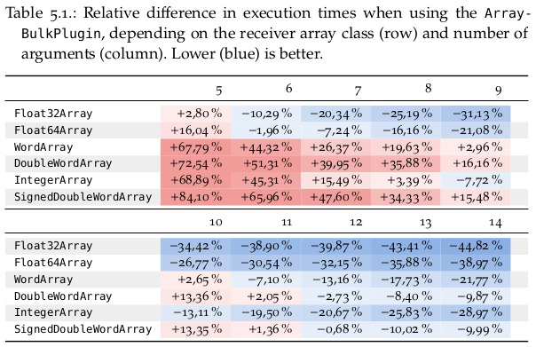
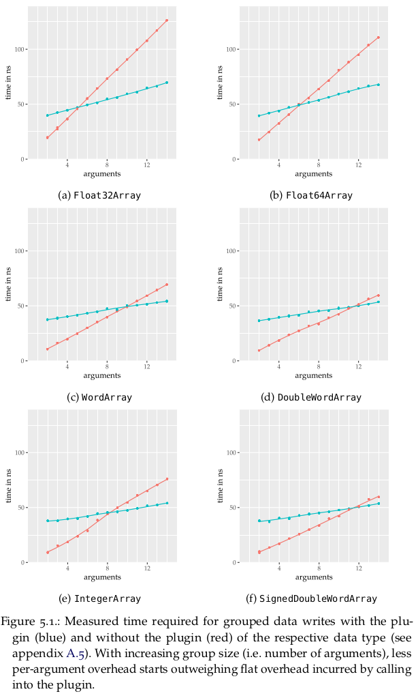

# Array Bulk Plugin
Plugins for [Squeak/Smalltalk]'s [VM]. Can improve data transfer speeds from Squeak to raw memory when writing multiple values at a time.

## Installation (for plugin users)
> Requires a build of the plugin accessible to the VM in order for the bulk primitives to work.

> Requires a recent [Metacello]. At least [metacello@`f336f66`](https://github.com/Metacello/metacello/commit/f336f66ba853f340edaffd5613a730b76be71676) for GitHub authorization. At least [metacello@`88e4d13`](https://github.com/Metacello/metacello/commit/88e4d1341906b1eb591ba4f05a5df10d021cc2a9) on Windows.

> Requires a [GitHub personal access token](https://github.com/settings/tokens) for [Metacello] to fetch this repository (since it's private).

```smalltalk
Metacello new
	baseline: 'ArrayBulkPlugin';
	repository: 'github://hpi-swa-lab/squeak-morphic-layers:main/ArrayBulkPlugin/squeak/';
	password: ''; "<-- put your GitHub personal access token here"
	load.
```
To see which dependencies will be installed or to find different load targets, look at the project's Metacello [baseline](./squeak/BaselineOfArrayBulkPlugin/BaselineOfArrayBulkPlugin.class.st).

## Benchmarks




### Example Code
```smalltalk
array := Float32Array new: 14.
[1 to: 1e3 do: [:index |
	array at: 1 put: 1.0.
	array at: 2 put: 2.0.
	array at: 3 put: 3.0.
	array at: 4 put: 4.0.
	array at: 5 put: 5.0.
	array at: 6 put: 6.0.
	array at: 7 put: 7.0.
	array at: 8 put: 8.0.
	array at: 9 put: 9.0.
	array at: 10 put: 10.0.
	array at: 11 put: 11.0.
	array at: 12 put: 12.0.
	array at: 13 put: 13.0.
	array at: 14 put: 14.0]] bench.
" '7,010 per second. 143 microseconds per run. 0 % GC time.'"

array := Float32Array new: 14.
[1 to: 1e3 do: [:index |
	array
		startingAt: 1
		put: 1.0 put: 2.0 put: 3.0 put: 4.0
		put: 5.0 put: 6.0 put: 7.0 put: 8.0
		put: 9.0 put: 10.0 put: 11.0 put: 12.0
		put: 13.0 put: 14.0]] bench.
" '17,900 per second. 55.9 microseconds per run. 0 % GC time.'"
```

<!-- references -->
[Squeak/Smalltalk]: https://squeak.org
[Metacello]: https://github.com/Metacello/metacello
[VM]: https://github.com/OpenSmalltalk/opensmalltalk-vm